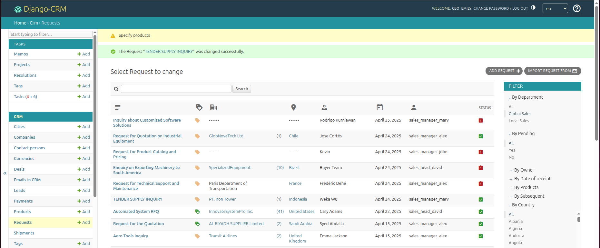

---
hide:
  - toc
title: Open Source Customer Relationship Management
description: CRM with email integration for managing sales, support, and customer workflows. Track inquiries, automate lead conversion and leverage analytics to boost performance

---

# Explore the CRM Application in Django CRM suite

The CRM application at the core of the Django CRM software package gives sales teams, support staff, and business owners a centralized platform to handle customer inquiries, commercial requests, and deal workflows. Secure your CRM by assigning granular permissions. Control who can view, add, edit, or delete each type of record, and maintain compliance with internal policies. With role-based access control, each user sees only the data they need.  
Data from the CRM app flows into the Analytics module for in-depth reporting on sales funnels, revenue breakdowns, and conversion metrics—helping teams refine tactics and boost performance.

<figure markdown="span">
  { loading=lazy width="680"}
  <figcaption>Screenshot of the Requests page in CRM Software</figcaption>
</figure>

---

## Commercial Requests Management

* **Capturing incoming inquiries**  
  Incoming inquiries can be captured from website forms, emails, or entered manually. Each request is tagged “pending” until validated.

* **Entity Linking**  
  On save, the system looks for matching Company, Contact Person, or Lead records and attaches the request to existing records when possible.
  If a new request doesn’t match any existing entity, the system spawns a Lead record automatically.

* **Verification & Filtering**

    * Valid requests proceed toward deal setup.
    * Irrelevant or unfulfillable requests are marked as such or removed.
    * A Real-time counters show the number of requests received from each client.

* **Geolocation Insights**  
  IP-based lookup detects the country and city of each correspondent, helping teams assign territory-based follow‑up.

* **Spam Protection**  
  Administrators can add banned company names and stop phrases to filter out repetitive or unsolicited submissions.

---

## Company, Contact & Lead Management

* **Smart Record Creation**  
  Maintain a structured directory of organizations and associated contacts. View company profiles alongside all related deals, communications, and activities.

* **Lead Conversion Workflow**  
  Validated Leads can be elevated to full Customer records with a single click, retaining all historical request data.

* **Duplicate Prevention**  
  Before converting a Lead to a formal Company and Contact, the CRM cross‑checks existing entries to avoid duplicates.

---

## Deals processing

* **Deal Objects**  
  Create an Opportunity (Deal) directly from a verified request. Each Deal serves as a workspace for tracking progress toward closing.

* **Customizable Pipelines**  
  Define your own sales stages such as proposal, negotiation, closing and monitor each Deal visually as it advances.

* **Status Indicators**  
  Icons flag the next required action, due dates, and overall health of each pipeline stage.

* **Sorting & Filtering**  
  New Deals appear at the top by default; teams can reorder by next-step date, priority, or custom fields.

* **Closing Deals**  
  When a Deal concludes, select a “Won” or “Lost” reason from the dropdown. Closed Deals are hidden from active lists but remain searchable in the database.

---

## Currency & Payment Handling

* **Multi‑Currency Support**  
  Manage international transactions with multiple currencies. Specify a national currency and a separate currency for marketing reports if needed.

* **Exchange Rate Updates**  
  Rates can be entered manually or fetched via external services, ensuring financial data stays accurate.

* **Payment Recording**  
  Log payments directly on the Deal page or from the centralized Payments view. All entries feed into analytical reports for revenue analysis.

---

## Integration & Extensibility

* **Web Forms**

    * Built‑in reCAPTCHA and IP capture.
    * Customizable design to match brand guidelines.
    * Field validation guards against incomplete or invalid entries.

* **Email Integration**

    * Send and receive messages within the CRM using SMTP/IMAP.
    * Automatic **ticket** numbering keeps correspondence organized.
    * Possibility of manual import of historical letters and linking them to Deals.

* **Data Import/Export**  
  Excel support for bulk handling of Companies, Contacts, Leads, and Deals makes migrations and backups straightforward.

---

## Shipment Tracking

* **Contract Ship Dates**  
  Assign expected shipping dates to each Deal.

* **Real‑Time Status**  
  Shipment progress is displayed within the Deal record, ensuring sales teams and operations stay aligned on delivery timelines.

---

By consolidating inquiries, customer data, and deal pipelines in one application, the CRM app software empowers teams to manage their sales lifecycle with greater visibility and control—backed by in-depth analytics and customizable workflows.
