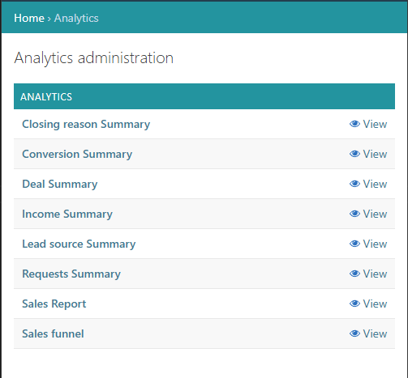
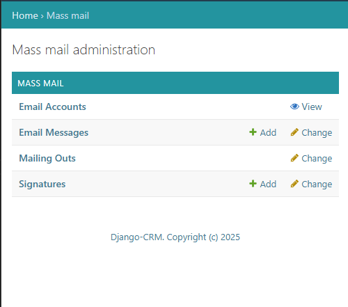

---
hide:
  - toc
title: CRM Application Software Overview
description: Uncover the All-in-One CRM Software for Tasks, Analytics, and Email Campaigns — all designed to boost team efficiency and drive business growth.

---

# CRM Software Overview

Discover how [Free CRM management software](https://github.com/DjangoCRM/django-crm/){target="_blank"} simplifies team collaboration with task management, real-time notifications, and role-based access. Enhance productivity while keeping all communication centralized.  
Gain actionable insights with analytics module.

## Main sections/applications of the CRM system

### Tasks section: Organize Work and Collaborate Effectively

{ align=left width="600" loading=lazy }
{ .card }

The **Tasks** section is designed to support day-to-day planning and team coordination. It’s **accessible to all users**, regardless of their role in the system:  
- **Create personal tasks and memos** to manage your <nobr>to-do</nobr> list.
- **Send office memos to managers** to keep communication clear, updates or reports.  
- **Managers** can also assign **individual or group tasks** and manage **projects** for their team.  
Each task, memo, or project comes with built-in **chat**, **file attachments**, and **reminder features**, helping keep all communication and materials in one place.  
Users stay informed with real-time **CRM notifications** and **email alerts**, ensuring nothing slips through the cracks.
[Read more](tasks-app-features.md){ .md-button }
{ .card }

---

### CRM app - Central Hub for Sales Management

The CRM section of Django CRM is designed to optimize sales workflows and centralize communication. Access is role-based, ensuring that users only see the data they need.
Here's what you can expect:  
- **Automatic lead capture**: Leads can be created automatically via web forms or semi-automatically by parsing incoming emails. Once qualified, they can be effortlessly converted into companies and linked contacts.  
- **Email Integration**: Connect your Gmail or other email accounts to keep all communication in one place — the system automatically syncs correspondence related to commercial inquiries and sales opportunities.  
- **Two departments**: — Local Sales and Global Sales — come pre-configured, giving your teams a clear structure.
With Django CRM’s CRM section, your sales workflow becomes smarter, faster, and more connected.  
Whether you're managing a few leads or coordinating global sales, this CRM section keeps your pipeline organized and communication consistent.  
[Read more](crm-app-features.md){ .md-button }
{ .card }

<figure markdown="span">
{ align=left width="600" loading=lazy }
</figure>

---

### Analytics section

{ align=left width="600" loading=lazy }
{ .card }

The section provides a comprehensive overview of sales performance for both managers and executives. With <nobr>**role-based access**</nobr>, each user sees only the data relevant to their responsibilities.  
The module includes **eight detailed reports**, such as:  
- Reasons why deals were closed.
- Conversion rates from inquiries to successful deals.  
- Current monthly income and a forecast for the next two months.  
- Sales funnel visualization.  
These reports can be filtered by **individual sales manager**, **department**, or **company-wide** scope, allowing for targeted analysis and strategic planning.  
By offering structured, real-time insights, the Analytics section helps teams identify trends, assess performance, and adjust tactics effectively.  
[Read more](analytics-app-features.md){ .md-button }
{ .card }

---

### Mass mail section

This section offers a flexible way to manage bulk email campaigns while keeping them personal and relevant.  
Access to this feature is **role-based**, ensuring that only authorized team members can launch or manage email distributions. Users can **integrate their email accounts** (e.g., Gmail) and set up **multiple personalized signatures** for different use cases or team members. With built-in tools for **dynamic content generation**, each email can be **automatically customized** to match the recipient’s details. The platform also allows for **contact segmentation**, so you can target specific groups with tailored messages. During your campaign, you'll receive a **detailed report** that tracks the performance of each campaign, helping you measure engagement and improve your approach.  
[Read more](#){ .md-button }
{ .card }

<figure markdown="span">
{ align=left width="600" loading=lazy }
</figure>

---

The CRM package also contains supporting applications such as:

- Chat app (chat is available in every instance of a task, project, office memo and deal)
- VoIP app (call customers directly from the deal page)
- Help app (help pages with dynamic content depending on the user's role)
- Common app:
    - 🪪 User profiles
    - ⏰ Reminders (for tasks, projects, office memos and deals)
    - 📝 Tags (for tasks, projects, office memos and deals)
    - 📂 Files (for tasks, projects, office memos and deals)

---

## Key Features common to all CRM Applications

### Filters and Sorting

- **Filter Panel**: The filter panel, located on the right side of each object list page, allows users to narrow down the displayed data.  
  Some filters come with default values (e.g., only showing active tasks). Filters can be customized and saved for future use.
- **Advanced Sorting**: In addition to basic sorting by column headers, users can apply multi-level sorting for more complex data views.  
  For instance, tasks can be sorted first by due date and then by priority level.
  
### Object Identification and Search

- **ID-Based Search**: Objects can be quickly located by entering "ID" followed by the object's number (e.g., ID1234).
- **Ticket-Based Search**: Commercial requests and related objects as Emails, Deals, etc. can be found by their unique ticket identifier by typing "ticket:" followed by the value (e.g., ticket:tWRMaat3n8Y).
- **Automatic Search Algorithms**: The CRM uses several identifiers (e.g., first name, email, phone number) to match and link objects, such as requests to companies and contact persons.  
  The system automatically suggests related entities during searches.

---

The Django-CRM system is a powerful and flexible solution for managing customer relationships.  
It offers a wide range of features to handle various business objects, automate email marketing, and gain insights through analytics.  
By leveraging these features, businesses can enhance their customer relationship management processes and make informed decisions.
