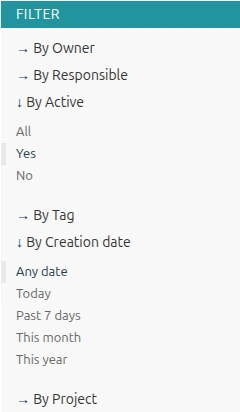
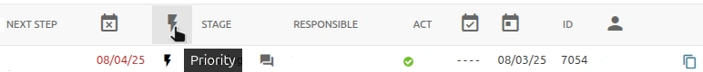

# **Task Management in Django CRM**

The task list in Django CRM helps users and teams organize daily work,
manage personal and [team tasks](#working-with-team-task), track progress with subtasks,
and communicate directly in task chats. Here you will learn how to create tasks,
assign roles, update stages, use filters and tags, and make teamwork more efficient with
automated notifications and collaboration tools.  
Read more about the key features of [task management software](../features/tasks-app-features.md).

---

## **Creating task**

To create a task, click the "**ADD TASK +**" button in the upper right corner.  
After filling out the form and saving the task, you will be able to create subtasks in it.

### Who Can Create Task

- A **manager** or **department head** can assign tasks to their team.
- **Users** can also create task for **themselves**. In this case, the department head is automatically added as a co-owner.
- In team task, **executors** can create subtasks for **one another**.

---

{ loading=lazy align="right" }

## **Task Filters**

Use the **filter panel** on the right side of the task list to quickly find tasks.

- Managers can filter by employee to see their current workload.
- Some filters have default values (for example, the default list shows only active tasks).

---

## **Sorting Tasks**

- By default, new tasks appear at the top of the list.
- For more effective tracking, especially over time, it’s recommended to sort tasks by the **Next Step date**.
- Sorting can be switched with the toggle button in the top-right corner of the task list.

Most of the task table titles are active. By clicking on them, you can also sort tasks.
<figure markdown="span">
    { loading=lazy }
    <figcaption>Sorting tasks by priority</figcaption>
</figure>

---

## **Types of Tasks**

- **Personal task** – assigned to a single user.
- [**Team task**](#working-with-team-task) – involve multiple users.
- **Subtask** – can be created for any task. A task becomes a **main task** if it has at least one subtask.
- Tasks can also belong to a **project** for better organization.

---

## **User Roles**

Each task can have different participants with specific roles:

- **Owner** – the user who created and manages the task.
- **Co-owner** – automatically or manually (*optional*) assigned user.
- **Responsible (executors)** – users who perform work or delegate it by creating subtasks for others and managing them.
- **Subscribers** – notified about task progress and results.
- **Task operators (*optional*)** – administrators with the same rights as owners.  
This role is similar to the CRM administrator but has rights only in the task management module.
To obtain this role, please contact your CRM administrator.

---

## **Task Stages**

Tasks go through different stages:

- **Pending**, **In progress**, **Done**, **Postponed**, **Canceled**.

The **executor** usually updates the stage, but owners or operators can do this as well.

- In team tasks, the first three stages are updated automatically.
- Stages can be changed at any time. For example, if a completed task still requires work, the owner can add a “next step” and return the stage to *In progress*.

---

## **Notifications**

All task participants receive CRM and email notifications about:

- task creation
- task completion
- chat messages
- assignments:

    - task co-owner
    - task subscriber

---

## **Task Chat**

Each task has a built-in chat for exchanging messages and files.

- Subscribers can also join discussions about task progress.
- To start, click "**Message +**", choose recipients, and send your first message. Afterward, a "**Chat**" button will appear to view the entire conversation.

---

## **Tags**

You can create custom tags to group and track tasks.

- Example: Add a “Production meeting” tag to all tasks you want to discuss at the next meeting.
- Tasks can be filtered by tags.

---

## **Working with Team Task**

- The **responsible user** must create a subtask for themselves. All other executors of the main task will be added as subscribers.
- The subtask copies the title and description of the main task. The executor should adjust these details to clarify their specific work.
- If the responsible user simply clicks **Done**, a completed subtask will be created automatically, and the main task will disappear from their list.
- Executors can also create subtasks for each other.
- When the first subtask is created, the main task automatically switches to the "In progress" state.
- The main task is marked as done when all performers have at least one completed subtask and
there are no subtasks left pending or in progress.

---

✅ With these tools, Django CRM makes it easier to organize work, follow progress, and collaborate on tasks across your team.

---
