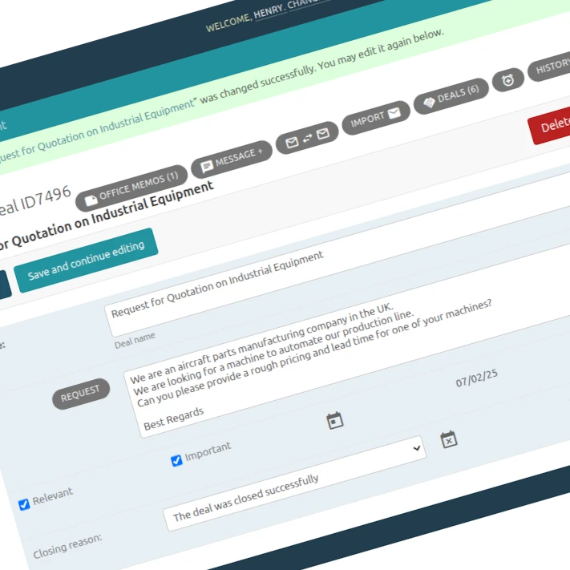
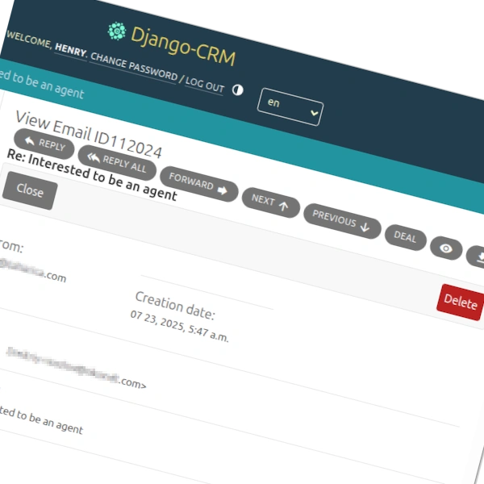

---
hide:
  - navigation
  - toc
title: Free & Open-Source CRM App Software
description: Analytical CRM offers contact management, sales tracking, email marketing, and more. Customize your workflow and keep your data secure – no vendor lock-in!
---

## **What Makes Django CRM Different?**

**Django-CRM** is a customer relationship management CRM solution designed with **two primary goals**:

- **For business users**: Deliver a professional-grade open-source CRM software with all the tools needed to manage customers, sales, and workflows — completely free and under an open source license.  
- **For maintainers and developers**: To make it significantly easier to:

    - customize the software
    - deploy and support of a production server
    - develop and extend functionality

Access to the company's business data remains solely under its control.  
**This CRM is perfect for businesses that want full control over their CRM solution without vendor lock-in.**

Django CRM is built entirely on the widely used [Django Admin](https://docs.djangoproject.com/en/dev/ref/contrib/admin/){target="_blank"} framework. This means most
[Python](https://www.python.org/){target="_blank"}/Django developers and integrators can easily understand, customize, and extend the system — reducing
implementation time and long-term maintenance expenses compared to similar products.

---

<figure markdown="span">
  { loading=lazy width="680"}
  <figcaption>Screenshot of the deals page in CRM</figcaption>
</figure>

Over time, CRM systems inevitably **accumulate large volumes of data** across leads, contacts, tasks, and interactions. A **tabular presentation** with flexible filtering and sorting options helps users **quickly locate relevant records**, analyze key details, and manage daily operations efficiently—even as the dataset grows. This format supports faster decision-making and reduces the time spent navigating complex information.

<figure markdown="span">
  { loading=lazy }
  <figcaption>Pagination of deals</figcaption>
</figure>

---

## **Comprehensive features of CRM software**

- :material-contacts-outline: **[Contact Management]** – Store and manage customer information, interactions, and activities
- :material-account-cash-outline: **[Sales Tracking]** – Track leads, opportunities, and deals to improve sales performance
- :material-clipboard-check-multiple-outline: **[CRM Task Management]** – Create and assign tasks to team members for better collaboration and productivity
- :material-finance: **[CRM Analytics Software]** – Generate reports and analyze data to make informed business decisions
- :material-email-fast-outline: **[CRM Email Marketing]** – Send personalized email campaigns directly from the CRM
- :material-translate: **[Project Localization]** – Customer service software is now **available in 20+ languages**

  [Contact Management]: features/crm-app-features.md#company-contact-lead-management
  [Sales Tracking]: features/crm-app-features.md
  [CRM Task Management]: features/tasks-app-features.md
  [CRM Analytics Software]: features/analytics-app-features.md
  [CRM Email Marketing]: features/massmail-app-features.md
  [Project Localization]: index.md

---

!!! note "**Common Problems Faced by SaaS CRM Clients**"

    ??? info "1. High Subscription Costs with Low Feature Utilization"

          * Companies pay large annual fees for SaaS CRM licenses.
          * Typically, only 20-30% of the features are actually used.
          * Useful features are often locked behind expensive “premium” tiers.
    
    ??? info "2. Rigid workflows that don't match business needs"
    
          * SaaS platforms force businesses to adapt their workflows to fit predefined CRM structures.
          * Customizing business logic (e.g., lead scoring algorithms) requires expensive plugins, consultants, or workarounds.
          * Built-in tools are generic and often fail to handle industry-specific needs.
    
    ??? info "3. Customizations break during platform updates and Vendor Lock-in"
    
          * Custom features or integrations often break with each platform update.
          * Migration to another platform is made intentionally difficult and costly.
          * Companies become trapped into paying increasing subscription fees due to the complexity of switching.
    
    ??? info "4. Hidden Costs: Integration, Consulting, and Manual Work"
    
          * Integrating third-party tools or internal systems comes with high consulting costs.
          * Teams waste time on manual processes (data exports, custom reports) because automation is limited or broken.
          * Productivity losses are not accounted for in ROI calculations but have a real business impact.
    
    ??? info "5. Slow Response to Unique Requirements"
    
          * Feature requests or necessary changes depend on vendor development timelines.
          * Critical business requirements are often low priority for large CRM vendors.
          * Businesses are left waiting or forced into costly custom development on top of already expensive platforms.

!!! question "**How Django CRM Solves These Problems**"

    ??? success "1. Free, open-source software with no per-user costs"

          * Django CRM is **free, open-source software**—no license fees, no per-user costs.
          * You fully own the codebase and data, with no vendor lock-in.
          * Initial development costs can be recovered over time through lower operating expenses.

    ??? success "2. Fully customizable data models and logic"

          * Django CRM allows you to **modify the CRM’s logic and data models directly**.
          * You can implement custom lead scoring, unique sales processes, or niche workflows tailored to your industry.
          * No need to patch together external tools or bend your process to fit generic CRM templates.

    ??? success "3. Stable Customizations that You Control in your own CRM"

          * You decide when and how to update your CRM.
          * Custom features are part of your codebase—not fragile external plugins that break during vendor updates.
          * Migration is always possible since the entire application is under your control.

    ??? success "4. Efficient Integrations via Django/Python Ecosystem"

          * Django’s modular architecture makes API integrations and automation straightforward.
          * You avoid proprietary “integration marketplaces” with hidden fees.
          * Internal systems, custom dashboards, and automation scripts can all run seamlessly within the same tech stack.

    ??? success "5. Agile Response to Business Needs"

          * Development cycles are determined by your team, not a vendor’s roadmap.
          * New features can be added incrementally, exactly when they are needed.
          * Django CRM is built to be **extended**, making it ideal for evolving business requirements.

---

## **CRM Application Software**

{ loading=lazy }
{ .card }

 The CRM is a free, open-source customer relationship management app built on the Django framework,
designed to help small businesses manage their sales pipeline and customer data more efficiently.
This CRM software app centralizes key processes—such as: lead tracking, deal management,
and internal communication—into a single, streamlined system.  
With features like **role-based access** control, advanced search filters,
integrated email and **VoIP communication**, and automatic request handling,
it supports teams in working collaboratively and staying organized.
The CRM application also enables users to track payments, manage tasks,
and gain insights through built-in analytics and sales funnel reports.  
**Custom roles** and permissions make it adaptable to any organizational structure,
ensuring each user has the right level of access. Whether you're handling commercial requests,
managing contacts, or analyzing sales performance, CRM helps **automate** and simplify your **workflow**.
As a flexible and fully documented solution, it’s ideal for companies looking to deploy a scalable
and customizable CRM software app without vendor lock-in.  
[Sales CRM Software](features/crm-app-features.md){ .md-button }
{ .card }

---

## **Easy project customization and development**

The CRM is built with flexibility in mind, making it easy to customize and extend for any business need. Whether you're adding new features, integrating third-party services, or modifying existing workflows, the codebase is easy to understand and extend.  
As a Python CRM, it leverages Django’s powerful framework to ensure rapid development and straightforward integration with third-party tools. With reusable components and clear documentation, adapting the CRM to your unique business logic takes minimal effort.  
Developers can add new features, adjust workflows, or connect external APIs without unnecessary complexity. The project follows Django best practices, making it simple to maintain and upgrade. With clear documentation and active community support, getting started is quick and efficient.

---

## **CRM and Email Marketing**

 The CRM combines powerful customer management tools with **built-in email marketing capabilities**,
making it a complete [**mailing CRM**](features/massmail-app-features.md) solution.
Users can run personalized email campaigns, manage subscriber lists, and track engagement—all from within the CRM interface.
Emails are linked directly to companies, contact persons, and lead, ensuring a unified communication history.
Bulk mailing features allow **targeted newsletters** without relying on external tools.  
Advanced **customer segmentation** enables precise targeting based on user-defined filters.
With automatic email synchronization and ticket-based tracking, you can maintain consistent customer communication at scale.
As a **CRM with email** functionality, CRM simplifies outreach while keeping your team aligned on every touchpoint.  
[CRM and Email Marketing](features/massmail-app-features.md){ .md-button }
{ .card }

<figure markdown="span">
{ loading=lazy width="600" }
</figure>

---
