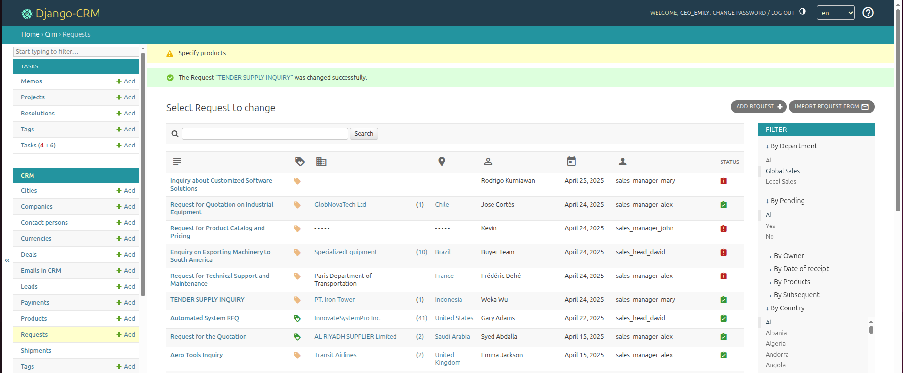

---
hide:
  - toc
title: Відкрите CRM для управління відносинами з клієнтами
description: CRM з інтеграцією електронної пошти для управління продажами, підтримкою та робочими процесами клієнтів. Відстежуйте запити, автоматизуйте конверсію лідів і використовуйте аналітику для підвищення продуктивності.

---

# Досліджуйте CRM-додаток у наборі Django CRM

CRM-додаток, який є основою програмного пакета Django CRM, надає команді продажів, відділу підтримки та власникам бізнесу централізовану платформу для обробки клієнтських запитів, комерційних пропозицій та робочих процесів зі сделками. Забезпечте безпеку вашого CRM, призначаючи детальні дозволи. Контролюйте, хто може переглядати, додавати, редагувати або видаляти кожен тип записів, і дотримуйтесь внутрішніх політик відповідності. Завдяки системі контролю доступу за ролями кожен користувач бачить лише ті дані, які йому потрібні. 
Дані з CRM-додатку надходять в модуль аналітики для глибокого звітування щодо воронок продажів, структури доходів і показників конверсії — це допомагає командам удосконалювати стратегії та збільшувати ефективність.

<figure markdown="span">
  { loading=lazy width="680"}
  <figcaption>Скріншот сторінки запитів у CRM</figcaption>
</figure>

---

## Управління комерційними запитами {#commercial-requests-management}

* **Збір вхідних запитів**  
  Вхідні запити можуть надходити із веб-форм, електронної пошти або вводитися вручну. Кожен запит позначається як “в очікуванні”, доки не буде перевірений.

* **Прив’язка сутностей**  
  Після збереження система шукає відповідні записи компанії, контактної особи або ліда й прив’язує запит до наявних записів, якщо вони знайдені.  
  Якщо новий запит не збігається з жодною існуючою сутністю, система автоматично створює запис ліда.

* **Перевірка та фільтрація**

    * Успішні запити переходять до налаштування угоди.
    * Нерелевантні або нездійсненні запити позначаються як такі або видаляються.
    * Лічильники в реальному часі показують кількість запитів, отриманих від кожного клієнта.

* **Дані про геолокацію**  
  За IP-адресою визначається країна та місто кожного кореспондента, що допомагає командам організовувати теренне подальше спілкування.

* **Захист від спаму**  
  Адміністратори можуть додавати заборонені назви компаній і стоп-слова, щоб фільтрувати повторювані або небажані подання.

> **Примітка:** Для детального огляду управління комерційними запитами зверніться до [документації з управління комерційними запитами](../help/commercial-requests-management.md).

---

## Управління компаніями, контактами та лідами {#company-contact-lead-management}

* **Розумне створення записів**  
  Підтримуйте структурований каталог організацій та пов’язаних контактів. Переглядайте профілі компаній разом з усіма пов’язаними угодами, комунікаціями та активностями.

* **Процес конверсії ліда**  
  Перевірені ліди можуть бути підвищені до повноцінних записів клієнтів одним натисканням, при цьому зберігається вся історія запитів.

* **Запобігання дублям**  
  Перед конверсією ліда в офіційну компанію та контакт CRM перевіряє наявні записи, щоб уникнути дублювання.

---

## Обробка угод

* **Об’єкти угод**  
  Створюйте можливість (угоду) безпосередньо з перевіреного запиту. Кожна угода служить робочим простором для відстеження прогресу до закриття.

* **Налаштовувані воронки продажів**  
  Визначайте власні етапи продажів, наприклад пропозиція, узгодження, закриття, і візуально відстежуйте кожну угоду в процесі її просування.

* **Показники статусу**  
  Іконки позначають наступну необхідну дію, строки виконання та загальний стан кожного етапу воронки.

* **Сортування та фільтрація**  
  Нові угоди з’являються зверху за замовчуванням; команди можуть впорядковувати їх за датою наступного кроку, пріоритетом або користувацькими полями.

* **Закриття угод**  
  Коли угода завершується, виберіть причину “Виграно” або “Програшено” зі спадного списку. Закриті угоди приховані з активних списків, але залишаються доступними для пошуку в базі даних.

---

## Валюта та облік платежів

* **Підтримка кількох валют**  
  Керуйте міжнародними транзакціями за допомогою кількох валют. Вкажіть національну валюту та окрему валюту для маркетингових звітів, якщо це необхідно.

* **Оновлення курсів валют**  
  Курси можуть вводитися вручну або отримуватися через зовнішні сервіси, що забезпечує точність фінансових даних.

* **Ведення платежів**  
  Ведіть платежі безпосередньо на сторінці угоди або з централізованого перегляду платежів. Усі записи надходять у аналітичні звіти для аналізу доходів.

---

## Інтеграція та розширюваність

* **Веб-формы**

    * Вбудований reCAPTCHA та визначення IP.
    * Налаштовуваний дизайн під бренд.
    * Перевірка полів захищає від неповних або недійсних даних.

* **Інтеграція з електронною поштою**

    * Надсилання та отримання повідомлень у CRM через **SMTP/IMAP**.
    * Автоматична нумерація **квитків** допомагає впорядковувати листування.
    * Можливість ручного імпорту історичних листів і прив’язки їх до угод.

* **Імпорт/експорт даних**  
  Підтримка Excel для пакетної обробки компаній, контактів, лідів і угод спрощує міграцію та резервне копіювання.

---

## Відстеження відправлень

* **Планові дати поставки**  
  Призначайте очікувані дати відправлення для кожної угоди.

* **Поточний статус**  
  Прогрес відправлення відображається в записі угоди, що дозволяє відділам продажів та операцій залишатися узгодженими щодо строків доставки.

---

> [CRM-інсталяція](https://django-crm-admin.readthedocs.io/en/latest/installation/)

Поєднуючи запити, дані клієнтів і воронки продажів в одному застосунку, CRM-програмне забезпечення дає командам можливість керувати життєвим циклом продажів із більшою видимістю та контролем — завдяки глибокій аналітиці та налаштовуваним робочим процесам.
