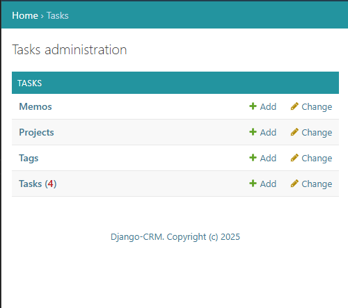
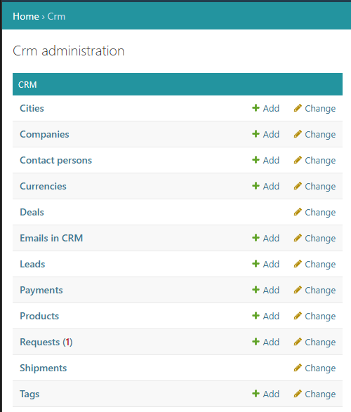
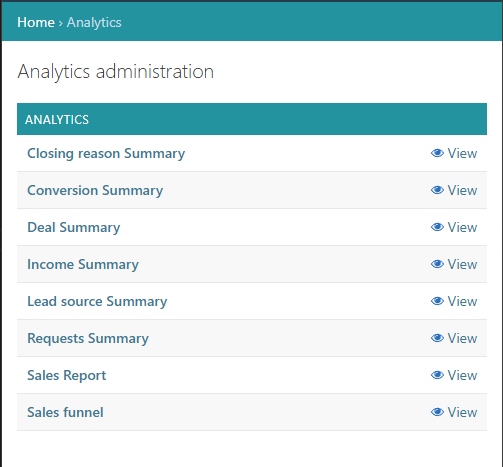
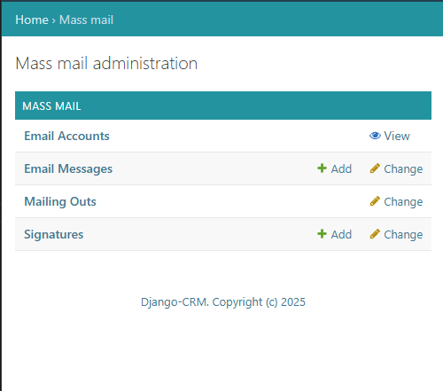

---
hide:
  - toc
title: Огляд програмного забезпечення CRM
description: Дізнайтеся про універсальне CRM-програмне забезпечення для управління завданнями, аналітики та email-кампаній — усе це підвищує ефективність команди та сприяє розвитку бізнесу.

---

# Огляд програмного забезпечення CRM

Дізнайтеся, як [безкоштовне CRM-програмне забезпечення](https://github.com/DjangoCRM/django-crm/){target="_blank"} спрощує співпрацю команди з управлінням задачами, повідомленнями в реальному часі та доступом за ролями. Підвищуйте продуктивність, зберігаючи всю комунікацію в одному місці.  
Отримуйте практичні висновки за допомогою модуля аналітики.

## Основні розділи/додатки CRM-системи

### Розділ задач: організуйте роботу та ефективно співпрацюйте

{ align=left width="600" loading=lazy }
{ .card }

Розділ **Завдань** призначений для щоденного планування та координації роботи команди. Він **доступний усім користувачам**, незалежно від їхньої ролі в системі:  
- **Створюйте особисті завдання та службові записки** для управління своїм списком справ.
- **Надсилайте службові записки менеджерам** для чіткої комунікації, оновлень або звітів.  
- **Менеджери** також можуть призначати **індивідуальні або групові завдання** та керувати **проєктами** для своєї команди.  
Кожне завдання, записка або проєкт має вбудовані **чат**, **вкладення файлів** та **функцію нагадувань**, що дозволяє зберігати всю комунікацію та матеріали в одному місці.  
Користувачі отримують актуальні **CRM-повідомлення** та **сповіщення електронною поштою**, завдяки чому нічого не пропускається.
[CRM та програмне забезпечення для управління задачами](tasks-app-features.md){ .md-button }
{ .card }

---

### CRM-додаток — центральний вузол для управління продажами

Розділ CRM у Django CRM розроблений для оптимізації продажів і централізації комунікації. Доступ має рольову модель, тому користувачі бачать лише ті дані, які їм потрібні.
Ось що ви отримаєте:  
- **Автоматичне захоплення лідів**: ліди можуть створюватися автоматично через веб-форму або напівавтоматично під час аналізу вхідних листів. Після перевірки їх легко конвертувати в компанії та пов’язані контакти.  
- **Інтеграція з електронною поштою**: підключіть облікові записи Gmail або інші поштові сервіси, щоб зберігати всю комунікацію в одному місці — система автоматично синхронізує листування щодо комерційних запитів і можливостей продажу.  
- **Два відділи**: локальні продажі та глобальні продажі — вже попередньо налаштовані, це дає команді чітку структуру.
Завдяки CRM-додатку в Django CRM ваш процес продажів стає розумнішим, швидшим і більш узгодженим.  
Незалежно від того, чи керуєте ви кількома лідами чи координуєте глобальні продажі, цей розділ CRM допомагає тримати воронку продажів в порядку та підтримувати єдність комунікації.  
[CRM-програмне забезпечення для продажів](crm-app-features.md){ .md-button }
{ .card }

<figure markdown="span">
{ align=left width="600" loading=lazy }
</figure>

---

### Розділ аналітики

{ align=left width="600" loading=lazy }
{ .card }

Цей розділ надає повний огляд показників продажів як для менеджерів, так і для виконавчого керівництва. Завдяки <nobr>**рольовому доступу**</nobr> кожен користувач бачить лише дані, релевантні його відповідальності.  
Модуль містить **вісім детальних звітів**, зокрема:  
- Причини закриття угод.
- Коефіцієнти конверсії від запитів до успішних угод.  
- Поточний місячний дохід та прогноз на наступні два місяці.  
- Візуалізацію воронки продажів.  
Ці звіти можна фільтрувати за **окремим менеджером з продажів**, **відділом** або **масштабом усієї компанії**, що дозволяє проводити точний аналіз і стратегічне планування.  
Завдяки структурованій інформації в реальному часі розділ Аналітики допомагає командам виявляти тенденції, оцінювати ефективність і коригувати тактику.  
[CRM-аналітичне програмне забезпечення](analytics-app-features.md){ .md-button }
{ .card }

---

### Розділ масової розсилки

Цей розділ пропонує гнучкий спосіб керування масовими **email-кампаніями**, зберігаючи їх персоналізованими та релевантними.  
Доступ до цієї функції має рольову модель, тому лише авторизовані члени команди можуть запускати або керувати розсилками. Користувачі можуть **підключити облікові записи електронної пошти** (наприклад, Gmail) і налаштувати **кілька персоналізованих підписів** для різних сценаріїв або співробітників. Завдяки вбудованим інструментам для **динамічної генерації контенту** кожен лист може **автоматично адаптуватися** до деталей отримувача. Платформа також дозволяє **сегментувати контакти**, щоб ви могли націлюватися на конкретні групи з персоналізованими повідомленнями. Під час кампанії ви отримаєте **детальний звіт**, який відстежує успішність кожної кампанії, допомагаючи оцінити залучення та покращити ваш підхід.  
[CRM та програмне забезпечення для email-маркетингу](massmail-app-features.md){ .md-button }
{ .card }

<figure markdown="span">
{ align=left width="600" loading=lazy }
</figure>

---

Пакет CRM також містить допоміжні застосунки, такі як:

- Чат (чат доступний у кожному екземплярі задачі, проєкту, службової записки та угоди)
- VoIP (здійснюйте дзвінки клієнтам безпосередньо зі сторінки угоди)
- Довідковий модуль (сторінки довідки з динамічним контентом залежно від ролі користувача)
- Спільний модуль:
    - 🪪 Профілі користувачів
    - ⏰ Нагадування (для задач, проєктів, службових записок та угод)
    - 📝 Теги (для задач, проєктів, службових записок та угод)
    - 📂 Файли (для задач, проєктів, службових записок та угод)

---

## Основні функції, спільні для всіх CRM-додатків

### Фільтри та сортування

- **Панель фільтрів**: панель фільтрів, розташована праворуч на сторінці списку кожного об’єкта, дозволяє користувачам звузити відображені дані.  
  Деякі фільтри мають значення за замовчуванням (наприклад, показ лише активних задач). Фільтри можна налаштовувати та зберігати для подальшого використання.
- **Розширене сортування**: крім базового сортування за заголовками стовпців, можна застосовувати багатоетапне сортування для більш складних переглядів даних.  
  Наприклад, задачі можна сортувати спочатку за датою виконання, а потім за пріоритетом.
  
### Ідентифікація об’єктів і пошук

- **Пошук за ID**: об’єкти можна швидко знаходити, вводячи “ID” та номер об’єкта (наприклад, ID1234).
- **Пошук за номером тикета**: комерційні запити та пов’язані об’єкти, такі як листи, угоди тощо, можна знаходити за їхнім унікальним ідентифікатором тикета, вводячи “ticket:” та значення (наприклад, ticket:tWRMaat3n8Y).
- **Автоматичні алгоритми пошуку**: CRM використовує кілька ідентифікаторів (наприклад, ім’я, електронна пошта, номер телефону), щоб зіставляти та прив’язувати об’єкти, такі як запити до компаній і контактних осіб.  
  Система автоматично пропонує пов’язані сутності під час пошуку.

---

Система Django-CRM є потужним і гнучким рішенням для управління відносинами з клієнтами.  
Вона пропонує широкий набір функцій для роботи з різними бізнес-об’єктами, автоматизації email-маркетингу та отримання аналітичних висновків.  
Використовуючи ці можливості, компанії можуть покращити процеси управління взаємовідносинами з клієнтами та приймати обґрунтовані рішення.
