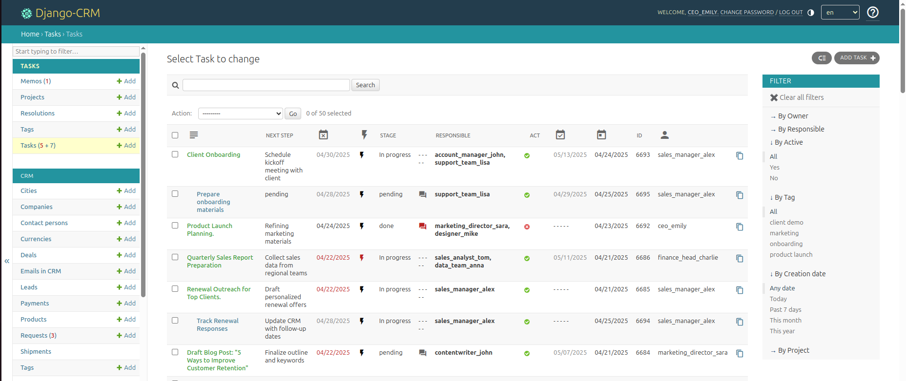
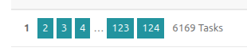
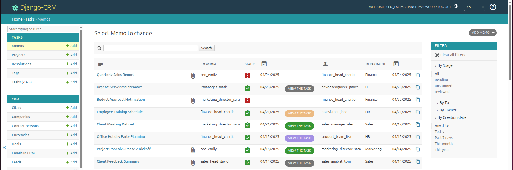

---
hide:
  - toc
title: CRM-програмне забезпечення для управління задачами
description: "Підвищуйте ефективність команди за допомогою CRM Task Manager — організовуйте робочі навантаження, призначайте проєкти та відстежуйте прогрес за допомогою інструментів для співпраці: чат, обмін файлами та нагадування"

---

# **Опануйте ефективне управління задачами в CRM: організовуйте, делегуйте та співпрацюйте**

**Програмне забезпечення для управління задачами** є невід’ємною частиною системи Django CRM, надаючи користувачам інструменти для організації, призначення та моніторингу як індивідуальних, так і командних завдань. Незалежно від того, чи ви керуєте щоденними обов’язками, чи контролюєте великі проєкти, застосунок задач пропонує надійну структуру, розроблену для підтримки ефективних робочих процесів у командах і відділах.

<figure markdown="span">
  { loading=lazy width="680"}
  <figcaption>Скріншот сторінки «Завдання» в CRM</figcaption>
</figure>

**Табличне представлення** задач дає користувачам CRM чіткий і структурований огляд, що полегшує керування та пріоритезацію великого обсягу завдань.
Це дозволяє користувачам швидко переглядати, легко порівнювати та ефективно сортувати або фільтрувати дані, розставляти пріоритети та краще керувати своїм навантаженням. Також це значно спрощує відстеження задач без перевантаження зайвою інформацією.

<figure markdown="span">
  { loading=lazy }
  <figcaption>Пагінація задач</figcaption>
</figure>

---

## **Ключові функції менеджера задач CRM**

[Менеджер задач](../../help/task-management.md) забезпечує інтуїтивно зрозумілий інтерфейс для створення, організації та відстеження **задач**, **проектів** і **нотаток CRM** (службових записок).  
Він розроблений для підвищення ефективності співпраці, підтримки команд у роботі та гарантування, що задачі виконуються вчасно.  
Ось що робить його особливим:

**Комплексне управління задачами:**

- Легко створюйте задачі, адаптовані до конкретних цілей або обов’язків.
- Кожна задача може мати кілька **підзадач**, що дозволяє розбивати складні завдання на менші, керовані частини.
- Завдання класифікуються за пріоритетом і статусом, допомагаючи користувачам зосереджуватися на термінових або незавершених роботах.
- Завдання можна призначати окремим людям або членам команди, забезпечуючи чітку відповідальність.
- Користувачі, яким потрібно бути в курсі задачі та її прогресу, але хто безпосередньо не бере участі в її виконанні, також можуть бути призначені як **підписники** цієї задачі.

**Розширене управління проєктами:**

- Об’єднуйте пов’язані задачі в **проєкти**, створюючи структурований і детальний підхід до управління кількома завданнями.
- Призначайте проєкти та задачі конкретним людям або командам, забезпечуючи чітке володіння та відповідальність.

**Інтегровані функції для кращої співпраці:**

- Використовуйте **теги** для категоризації задач або проєктів та користуйтеся відфільтрованими представленнями для легшої навігації.
- Прикріплюйте та діліться **файлами**, додаючи необхідні ресурси та документи безпосередньо в систему.
- Кожна задача має власний розділ **чату** для обговорень, що дозволяє зосередити комунікацію між учасниками однієї задачі або проєкту.
- Вбудована функція **нагадувань** допомагає дотримуватися дедлайнів і скорочує ризик пропущених термінів.
- **Сповіщення** надсилаються в CRM та електронною поштою, гарантуючи, що кожен учасник отримує миттєві повідомлення про оновлення задач, нові призначення або зміни дедлайнів, і може швидко реагувати.

---

## **Покращуйте ваші робочі процеси за допомогою мемо — нотатки CRM**

**Мемо** — це не просто нотатка CRM, яку користувачі пишуть для себе; це також службова записка та примітка для відділу.
Функція мемо в CRM розроблена для спрощення комунікації та делегування задач між різними структурними підрозділами, такими як маркетинг, обслуговування клієнтів і операційні процеси. Мемо є універсальним інструментом для документування та обміну інформацією, ухвалення рішень або розподілу відповідальності. Незалежно від того, чи надсилаєте ви важливі оновлення керівництву або членам команди, мемо гарантують ефективне управління всією комунікацією. Створюйте та поширюйте **службові записки** для критично важливої інформації або інструкцій.  
Перетворюйте мемо на дії — задачі або проєкти, щоб легко відстежувати виконання важливих пунктів із внутрішніх повідомлень.

<figure markdown="span">
  { loading=lazy width="680"}
  <figcaption>Скріншот сторінки «Мемо» в CRM</figcaption>
</figure>

Контролюйте прогрес задач, пов’язаних із нотатками, прямо зі списку мемо, підтримуючи зосередженість і інформованість команди.
Нотатки CRM можна створювати для себе, керівників відділів або менеджерів безпосередньо з розділу **Завдання** або навіть прив’язувати до угод, зберігаючи чіткий зв’язок між цілями та результатами.  
Мемо підтримують прикріплені файли, нагадування та вбудовані обговорення в чаті для спільної роботи в реальному часі між учасниками.  
Після перегляду мемо можна перетворити на дійсні задачі або проєкти. Ці дії фіксуються в CRM та прив’язуються до початкового мемо для зручного доступу.
Функція мемо в Django CRM дає компаніям ефективні інструменти для комунікації та прийняття рішень, забезпечуючи команді можливість швидко діяти на основі цінної інформації.

---

- :material-email-fast-outline: [**CRM email-маркетинг**](massmail-app-features.md)
- :material-download: [**Безкоштовне завантаження CRM**](../../download.md)

---

## **Переваги використання менеджера задач CRM**

**Ефективне делегування задач:**

- Менеджери та керівники команд можуть призначати задачі співробітникам або командам, забезпечуючи правильний розподіл навантаження.
- Задачі та їхній прогрес залишаються видимими, даючи керівництву кращий контроль над статусом виконання та відповідальністю.

**Покращена співпраця між командами:**

- Поєднання управління задачами з інтегрованими функціями чату та обміну файлами дозволяє уникати затримок і непорозумінь.
- Розмови та ресурси, пов’язані з задачами, зберігаються в централізованому місці, що спрощує повторне звернення до них.

**Прозорість відстеження прогресу:**

- Пріоритети задач, статуси та дедлайни дозволяють усім зацікавленим сторонам чітко розуміти поточний стан кожної відповідальності.
- Краща видимість підтримує швидше прийняття рішень і зменшує ризики для діяльності, що залежить від часу.

**Адаптивність до різних бізнес-сценаріїв:**

- Гнучкість у призначенні задач окремим людям або групам і організації їх у проєкти означає, що застосунок може бути адаптований до різних галузей.
- Від відстеження проєктів для команд розробників програмного забезпечення до управління задачами, пов’язаними зі продажами, застосунок підтримує різноманітні сценарії використання.

---

## **Варіанти використання CRM для управління задачами**

Універсальність застосунку задач робить його ідеальним рішенням для різних сценаріїв, зокрема:

1. **Управління проєктами для команд:**
   - Призначайте задачі з чіткими дедлайнами членам команди та відстежуйте їх виконання в контексті більшого проєкту.
   - Ідеально підходить для маркетингових кампаній, проєктів розробки програмного забезпечення або управління операційними процесами.

2. **Організація продажів і робочих процесів:**
   - Поєднуйте застосунок задач із функціями CRM, такими як угоди та ліди, для управління відстеженням продажів, збором документів та переговорами за контрактами.

3. **Координація внутрішніх процесів:**
   - Використовуйте мемо та нагадування, щоб гарантувати ефективне виконання внутрішніх процесів, наприклад оновлень політик або навчальних сесій для команди.

4. **Співпраця між відділами:**
   - Об’єднуйте такі відділи, як продажі, маркетинг, обслуговування клієнтів і операції, централізувавши задачі в одному інструменті для співпраці.

---

### Як це працює

1. **Створюйте та призначайте задачі:**
   - Швидко створюйте нові задачі, вказуючи назву, опис, виконавця та дедлайн.
   - Додавайте підзадачі для батьківських задач, щоб керувати залежностями.

2. **Налаштовуйте проєкти:**
   - Об’єднуйте окремі задачі в більші проєкти для кращого контролю.
   - Проєкти також підтримують додавання файлів і вкладень, служачи сховищем для відповідних документів.

3. **Контролюйте прогрес:**
   - Переглядайте призначені задачі на індивідуальних або командних панелях, включаючи поточний статус, дедлайни та оновлення.

4. **Відстежуйте комунікацію в реальному часі:**
   - Спілкуйтеся з учасниками задач безпосередньо через вбудовані канали чату та отримуйте оперативні оновлення.

5. **Будьте в курсі:**
   - Отримуйте системні сповіщення про призначення задач, нагадування, оновлення та завершення, отримуючи повністю інтегрований досвід.

---

Менеджер задач забезпечує структурований і надійний підхід до управління роботою, гарантуючи, що всі задачі, проєкти та мемо обробляються ефективно без прогалин у комунікації або виконанні. Завдяки інтеграції управління задачами з CRM-пакетом компанії можуть зосереджуватися на своїх цілях, одночасно підвищуючи ефективність і прозорість.

Від управління індивідуальними ролями до координації великих командних зусиль застосунок пропонує всі інструменти, необхідні для підтримки організованої та мотивованої команди.
